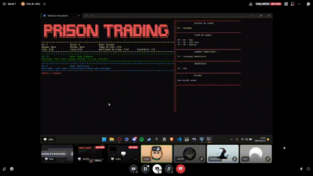

# Prison Trading

---

Prison Trading  é um jogo de estratégia e simulação com foco em resolver quebra-cabeças e trocas como elemento central. Nele, você assume o papel de um prisioneiro em uma prisão isolada, cada uma com seus próprios desafios e obstáculos. O objetivo principal é escapar da prisão, mas ao invés de simplesmente encontrar uma saída, você precisa resolver puzzles  para obter os itens necessários e criar os planos de fuga.

A troca de itens é crucial para o sucesso, já que você precisa negociar com outros prisioneiros(ou guardas) para conseguir os recursos necessários para seus planos. Isso adiciona uma camada estratégica ao jogo, pois você deve gerenciar seus recursos de forma inteligente e negociar com habilidade para obter o que precisa.

Além disso, você também precisa estar atento aos guardas e às rotinas da prisão, evitando chamar atenção enquanto trabalha em sua fuga. Combinando elementos de quebra-cabeças, estratégia e negociação, Prison Trading  oferece uma experiência desafiadora e envolvente para os jogadores que buscam um desafio intelectual e criativo.

---

## 👨‍🎓 Contribuidores

<table style="margin: 0 auto; width: fit-content;">
    <tr>
        <td align="center">
            <a href="https://github.com/brenoalexandre0">
                
                <h5 class="text-center"> Breno Alexandre Soares Garcia  </h5>
                <h5 class="text-center"> 200035703 </h5>
            </a>
        </td>
        <td align="center">
            <a href="https://github.com/show-dawn">
                
                <h5 class="text-center">Fernando Gabriel Dos Santos Carrijo   </h5>
                <h5 class="text-center"> 221008033 </h5>
            </a>
        </td>
       <td align="center">
            <a href="https://github.com/i-JSS">
                
                <h5 class="text-center"> João Antonio Ginuino Carvalho  </h5>
                <h5 class="text-center"> 221008150 </h5>
            </a>
        </td>
      <td align="center">
            <a href="https://github.com/Julio1099">
                
                <h5 class="text-center"> Júlio Cesar Gomes de Souza Crispim   </h5>
                <h5 class="text-center"> 221007591 </h5>
            </a>
        </td>
</table>

---

## 🎬 Apresentações

| Módulo   | Data de entrega do Módulo | Entrega                                                                      |
|----------|---------------------------|------------------------------------------------------------------------------|
| Módulo 1 | 21/07/2024                | [Modelagem](https://sbd1.github.io/2024.1-Prison-Trading/#/Modulo-1/Modulo1) |
| Modulo 2 | 18/08/2024                | [SQL](https://sbd1.github.io/2024.1-Prison-Trading/#/Modulo-2/Modulo2)       |
| Módulo 3 | 09/09/2024                | [Transações, Triggers, SP e Views](https://sbd1.github.io/2024.1-Prison-Trading/#/Modulo-3/Modulo3)                                         |

---

## 📅 Entregas

| Módulo 1 - 21/07/2024                                                                           |
|:------------------------------------------------------------------------------------------------|
| [Diagrama Entidade-Relacionamento](https://sbd1.github.io/2024.1-Prison-Trading/#/Modulo-1/DER) |
| [Modelo Entidade-Relacionamento](https://sbd1.github.io/2024.1-Prison-Trading/#/Modulo-1/MER)   |
| [Modelo Relacional](https://sbd1.github.io/2024.1-Prison-Trading/#/Modulo-1/MERL)               |
| [Dicionário de Dados](https://sbd1.github.io/2024.1-Prison-Trading/#/Modulo-1/DD)               |
| [Normalização](https://sbd1.github.io/2024.1-Prison-Trading/#/Modulo-1/NORM)                    |

| Módulo 2 - 18/08/2024                                                                                      |
|:-----------------------------------------------------------------------------------------------------------|
| [Correção - Diagrama Entidade-Relacionamento](https://sbd1.github.io/2024.1-Prison-Trading/#/Modulo-1/DER) |
| [Correção - Modelo Entidade-Relacionamento](https://sbd1.github.io/2024.1-Prison-Trading/#/Modulo-1/MER)   |
| [Correção - Modelo Relacional](https://sbd1.github.io/2024.1-Prison-Trading/#/Modulo-1/MERL)               |
| [Correção - Dicionário de Dados](https://sbd1.github.io/2024.1-Prison-Trading/#/Modulo-1/DD)               |
| [Correção - Normalização](https://sbd1.github.io/2024.1-Prison-Trading/#/Modulo-1/NORM)                    |
| [Tabela de Dados](https://sbd1.github.io/2024.1-Prison-Trading/#/Modulo-2/TDs)                             |
| [Linguagem de Definição de Dados - DDL](https://sbd1.github.io/2024.1-Prison-Trading/#/Modulo-2/DDL)       |
| [Linguagem de Manipulação de Dados - DML](https://sbd1.github.io/2024.1-Prison-Trading/#/Modulo-2/DML)     |
| [Linguagem de Consulta de Dados - DQL](https://sbd1.github.io/2024.1-Prison-Trading/#/Modulo-2/DQL)        |
| [Álgebra Relacional](https://sbd1.github.io/2024.1-Prison-Trading/#/Modulo-2/AL-REL)                       |
| [Roadmap](https://sbd1.github.io/2024.1-Prison-Trading/#/Jogo/Roadmap)                                     |
| [Tutorial de Instalação](https://sbd1.github.io/2024.1-Prison-Trading/#/Jogo/Info)                         |
| [Jogo demo](https://github.com/SBD1/2024.1-Prison-Trading/blob/main/src/main.py)                           |

| Módulo 3 - 09/09/2024                                                                                      |
|:-----------------------------------------------------------------------------------------------------------|
| [Correção - Diagrama Entidade-Relacionamento](https://sbd1.github.io/2024.1-Prison-Trading/#/Modulo-1/DER) |
| [Correção - Modelo Entidade-Relacionamento](https://sbd1.github.io/2024.1-Prison-Trading/#/Modulo-1/MER)   |
| [Triggers e Stored Procedure](https://sbd1.github.io/2024.1-Prison-Trading/#/Modulo-3/Triggers)                |
| [Views](https://sbd1.github.io/2024.1-Prison-Trading/#/Modulo-3/views)                                        |
| [pgAgent](https://sbd1.github.io/2024.1-Prison-Trading/#/Modulo-3/pgagent)                                    |
| [pg_stat_statements](https://sbd1.github.io/2024.1-Prison-Trading/#/Modulo-3/pgstatstatements)                          |
| [Atualização da Instalação](https://sbd1.github.io/2024.1-Prison-Trading/#/Jogo/Info)                   |
| [Jogo final](https://github.com/SBD1/2024.1-Prison-Trading/blob/main/src/main.py)                          |

